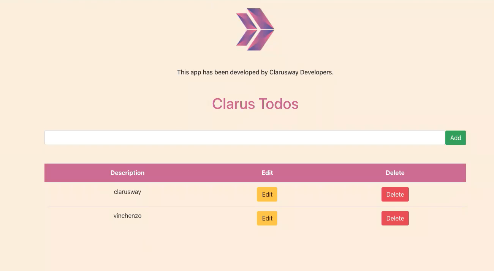

# Jenkins Pipeline for Web Page Application (Postgresql-Nodejs-React) deployed on EC2's with Ansible and Docker
## Description

This project aims to create a Jenkins pipeline to deploy web-page written Nodejs and React Frameworks on AWS Cloud Infrastructure using Ansible. Building infrastructure process is managing with control node utilizing Ansible. This infrastructure has 1 jenkins server (`Amazon Linux 2 AMI`) as ansible control node and 3 EC2's as worker node (`Red Hat Enterprise Linux 8 with High Availability`). These EC2's will be launched on AWS console. Web-page has 3 main components which are postgresql, nodejs, and react. Each component is serving in Docker container on EC2s dedicated for them. Postgresql is serving as Database of web-page. Nodejs controls backend part of web-side and react controls frontend side of web-page. The code was written by Clarusway's Developers and architecture will be created by Clarusway's AWS & DevOps Team.

## Project Skeleton

```bash
208:clarusway_jenkins_project (folder)
|
|----Readme.md                  # Given to the students (Definition of the project)
|----dockerfile-postgresql      # Given to the students
|----dockerfile-nodejs          # Given to the students
|----dockerfile-react           # Given to the students
|----main.tf                    # To be delivered by students (for managed nodes)
|----Jenkinsfile                # To be delivered by students
|----Ansible-Playbook           # To be delivered by students
|----student_files (folder)     # Given to the students (Postgresql, Nodejs and React files)
|       1.server (folder) ---> Nodejs folders and files
|       2.client (folder) ---> React folders and files
|       3.database (folder)--> init.sql file 
|----ansible.cfg                # Given to the students
|----inventory_aws_ec2.yml      # Given to the students
|----install-jenkins.tf         # Given to the students (Terraform template for Jenkins Server)
|----variables.tf               # Given to the students (Terraform template for Jenkins Server)
|----jenkins.sh                 # Given to the students (Terraform template for Jenkins Server)
|----node-env-template          # Given to the students (env template to take prostgresql node private ip)
|----react-env-template         # Given to the students (env template to take nodejs node private ip)

```

## Expected Outcome



### At the end of the project, following topics are to be covered;

- Jenkins Pipeline Configuration

- Create infrastructure with Terraform

- Deploy the application with Ansible

- Ansible playbook preparation

- Docker image creation for postgresql, nodejs and react containers

- Docker container launching using created image with ansible playbook

- Bash scripting

- AWS ECR as Image Repository

- AWS IAM Policy and Role Configuration

- AWS EC2 Launch Template Configuration

- AWS EC2 Configuration

- AWS EC2 Security Group Configuration

- Git & Github for Version Control System


# Provising Local requirements

- create project-208 folder on your local computer
- copy jenkins_server and student_files folder from remote project repo

# Provisioning Jenkins Server using terraform
-add managed_policy_arns "arn:aws:iam::aws:policy/AmazonS3FullAccess" to install-jenkins.tf
- goto jenkins_server folder
  - update variables.tf (key etc.)
  - terraform init
  - terraform apply -auto-approve
- glance at jenkins file (all reqirements has been added jenkins.sh file that is running from install-jenkins.tf)

# Provisioning Jenkins Server plug-in 
- for jenkins server configuration, apply 1-7 images added useful-images
- create private repo which name 'cd-todo-app' as private 
- create new token on github and dont forget given name which used jenkins server conf updating credentials
- pull repo to project-208 folder and copy all of the files from student files folder to cw-todo-app 
- node-env-template and react-env-template are using getting both ${NODE_IP} and ${DB_HOST} automatically after provisioning postgresql and react container

# Preparing docker container usind terraform 
-   goto react folder and add main.tf 
-   update keyname 
-   dont forget install-jenkins.tf 'jenkins-project-profile' is equal to main.tf iam_instance_profil
  
# Preparing ansible playbook
- create docker_project.yml
- update ecr_registry: <update your accout id>.dkr.ecr.us-east-1.amazonaws.com using aws account ID
- update docker container name and image_name to your name

# Preparing Jenkins file
- create Jenkinsfile
- prepare environment {} sections
- create stage('Create Infrastructure for the App') using terraform (main.tf is located same path with the Jenkins file)
  
- stage('Create ECR Repo') 
  
- stage('Build App Docker Image')
  - 'Building docker App Image'
- 
- stage('Push Image to ECR Repo') 
  - login ECR
  - docker push (postgre, nodejs, react) image

- stage('wait the instance')
  - waiting whether instane spinned up (postgre, nodejs, react) 

- stage('Deploy the App')
  - change credentialsId: 'your aws .pem'

- stage('Destroy the infrastructure')

- post {}

- failure {} 

- hold backend remote state using S3. for this purpose add 'backend "s3" onto main.tf' and create s3 bucket on aws which name is 'jenkins-project-backend'

# Push project files to github repo

- go to project-208 folder cw-todo-app loceted local and  run command below
  - git add .
  - git commit -m "all project files has been added"
  - git push
  
- after this process all files added github/cw-todo-app repo
  
# Create pipeline using jenkins server IDE

- New item --> pipeline --> name "project208" --> goto Pipeline --> pipeline script from SCM --> SCM --> Git --> URL : https://github.com/Gakcin/cw-todo-app.git --> set credienrials as project --> Branch Specifier : */main

- build project208 pipeline